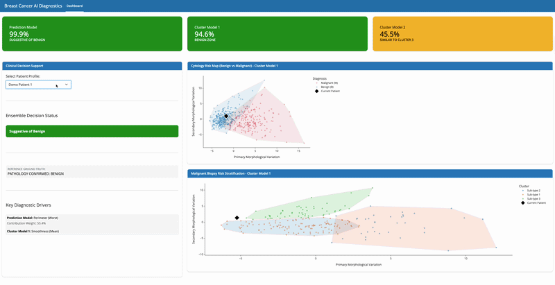

# Breast Cancer Diagnostics Dashboard

> An interactive diagnostic and visualization tool designed to compare morphological features between benign and malignant cases in breast cancer.

[Live App](jentsang-breast-cancer-diagnostic.share.connect.posit.cloud/)

## Demo


## Dataset
The dashboard utilizes the **Breast Cancer Wisconsin (Diagnostic) Dataset**, which is publicly available through the following sources:

* **UCI Machine Learning Repository**: [Breast Cancer Wisconsin (Diagnostic) Data Set](https://archive.ics.uci.edu/dataset/17/breast+cancer+wisconsin+diagnostic)
* **Kaggle**: [Breast Cancer Wisconsin (Diagnostic) Data Set](https://www.kaggle.com/datasets/uciml/breast-cancer-wisconsin-data)

Features are computed from a digitized image of a fine needle aspirate (FNA) of a breast mass, describing characteristics of the cell nuclei present in the image.

## ML Implementation

This diagnostic tool uses a Triple-Validation Ensemble architecture, pairing a high-sensitivity supervised model with 2 unsupervised models to provide predictions and visualization. 

### Supervised Learning: XGBoost
**Goal**: Primary Diagnostic Classification.

**Performance**: Optimized for 95% sensitivity (recall) to prioritize the detection of malignant cases and minimize clinically dangerous False Negatives.

**Training**: Built on a 30-feature dataset (FNA morphology) with an 80/20 train-test split.

### Unsupervised Learning: PCA + GMM
- **Principal Component Analysis (PCA)**: Reduced the 30-dimensional feature space to 2 principal components. This transformation preserves clinical interpretability, allowing doctors to visualize the morphological features of cellular data on a 2D map.

- **Gaussian Mixture Models (GMM)**:

  - Global Mapping: Used to define the mathematical "territories" of Benign vs. Malignant morphology.

  - Sub-type Clustering: Applied strictly to malignant cases to identify distinct morphological clusters and act as an Anomaly Detector for benign cases.

  - Explainability: Unlike "hard" clustering, GMM provides probability densities, allowing the tool to flag outliers—cases where the tumor's shape is atypical and requires higher clinical review.

### The Ensemble Logic
The dashboard reconciles these models to provide a final Consensus Status. If the XGBoost prediction contradicts the GMM topological mapping, the system triggers a Critical Warning, effectively "opening the black box" and highlighting potential false negatives for the clinician.

## Installation & Local Development

### 1. Clone the repository

```bash
git clone https://github.com/jentsang/BreastCancerDiagnostic.git
cd BreastCancerDiagnostic
```

### 2. Create and activate the conda environment

```bash
conda env create -f environment.yml
conda activate breast_cancer_diagnostic
```

### 3. Run the dashboard

```bash
shiny run app.py --reload
```

### 4. Open in your browser

```
http://127.0.0.1:8000
```

---

### Contributors
* **Abhinav Aggarwal**
* **Jennifer Tsang**
* **Kevin Dong**
* **Lila Chan**
* **William Lee**


### License
This project is licensed under the MIT License.
